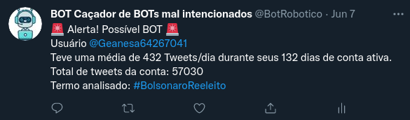
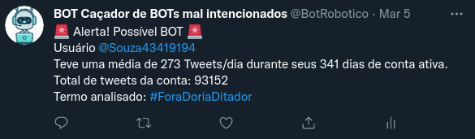
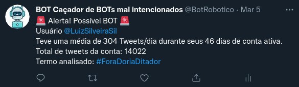
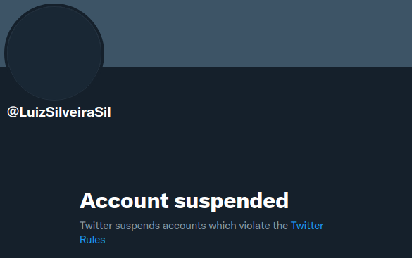
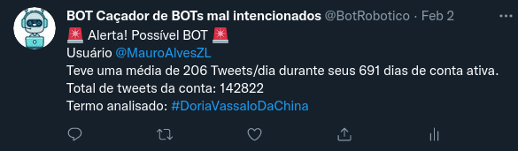
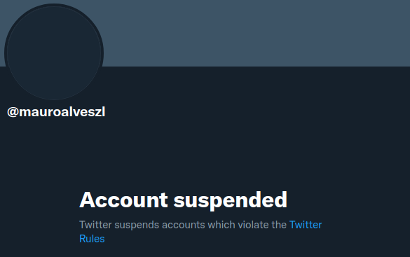
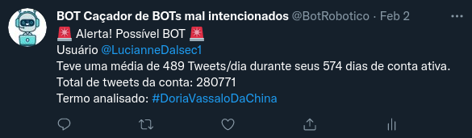
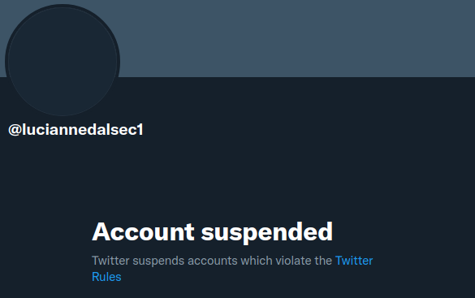

# BotHunter 🤖

Bot that tries to identify political bots that spread fake news and other related things

See [Twitter Account Here! 🤖 @BotRobotico](https://twitter.com/BotRobotico)

## How it works? 

1. Verify if exists political terms on Trending Page. 

2. If so, the bot starts checking the latest tweets.

3. For each tweet, the bot will check the user stats.

4. If the user has these conditions:
    - The last 20 tweets are only retweets
    - The account has an average of 200+ tweets per day, during its existence.

5. If both conditions are true, then the bot will tweet an alert. Saying that account is possibly a bot.

---

## Warning example 🚨



```python
# English 🇺🇸
"🚨 Alert! Possible BOT 🚨"
f"User @{username}"
f"Average {avg_tweets} Tweets/day during his {days} active account days."
f"Total account tweets: {user.tweets}"
f"Term parsed: {term}"
```
---

## Examples of some supended accounts 🚫

### Go to twitter 💀 [Souza43419194](https://twitter.com/Souza43419194)



### Go to twitter 💀 [LuizSilveiraSil](https://twitter.com/luciannedalsec1)



<details><summary><strong>See more supended accounts</strong></summary>

### Go to twitter 💀 [MauroAlvesZL](https://twitter.com/MauroAlvesZL)



### Go to twitter 💀 [LucianneDalsec1](https://twitter.com/luciannedalsec1)



</details>

---

## How to run

### 1. Requirements

- Email/Phone Verified Twitter Account
- A [Twitter Developer Account](https://developer.twitter.com/en/) (which is the same twitter account)

### 2. Dependencies

<details><summary><strong>Setting up a virtual environment (strongly recommended)</strong></summary>

In your terminal, go to the project folder (`bothunter`) and run the following commands:

Linux
```sh
python -m pip install --user virtualenv
python -m venv .venv
source .venv/bin/activate
```

<details><summary>Windows</summary>

```sh
python -m pip install --user virtualenv
python -m venv venv
.\venv\Scripts\activate.bat
```

</details>
</details>

#### Install all needed packages

```sh
pip install -r requirements.txt
```

### 3. Developer portal
Go to [Developer Portal Dashboard](https://developer.twitter.com/en/portal/dashboard)

1. Create an App/Project
2. In **App Permissions** set it to `Read and Write`
3. In **Keys and Tokens** generate `Consumer Keys`
4. Create a `credentials.py` file in the project's root folder (or copy `credentials_example.py` then rename it)

```sh
bothunter/
  ├── bot_actions.py
  ├── bothunter.py
  ├── bot_identifier.py
  ├── credentials_example.py
  ├── credentials.py
  ...
```
Copy and paste the consumer keys into `credentials.py`

```python
# credentials.py
BEARER_TOKEN = ""

CONSUMER_KEY = ""
CONSUMER_SECRET = ""

ACCESS_TOKEN = ""
ACCESS_TOKEN_SECRET = ""
```
### 4. Finally! 🚀

Run the command `python bothunter.py`

Now your bot is working 🤖
```sh
(.venv)  ~/pj/bothunter: python bothunter.py
########################################
Buscando Hashtags que contém um dos seguintes termos
['bolsonaro',
 'jairbolsonaro',
 'presidente',
 'doria',
 'lula',
 'moro',
 'Maia',
 'FlavioBolsonaro',
 'EduardoBolsonaro',
 'STF',
 'salles',
 'lira',
 'cpi']
Nenhuma Hashtag encontrada, ficarei procurando a cada 30 segundos
Nenhuma Hashtag encontrada, ficarei procurando a cada 30 segundos
```

---

### 📫 How to reach me <a name="how-to-reach-me"/>
<div> 
  <a href = "mailto:brochj@gmail.com"></a>
  <a href="https://www.linkedin.com/in/oscarbroch/" target="_blank"></a> 
</div>

### `brochj@gmail.com`