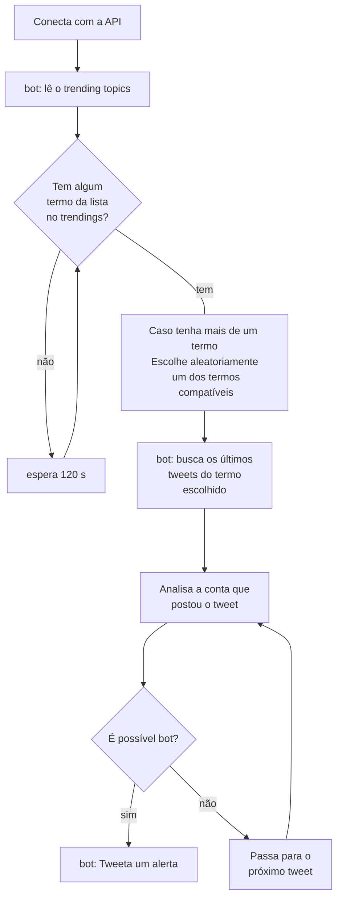

# UML Diagrams

## How it works - Flowchart

```mermaid
flowchart TD;
    A[Conecta com a API]-->B[bot: lê o trending topics];
    B-->C{Tem algum\ntermo da lista\n no trendings?};
    C-- não -->D;
    D[espera 120 s]--->C;
    C-- tem ---E;
    E[Caso tenha mais de um termo\nEscolhe aleatoriamente\n um dos termos\n compatíveis ]-->F;
    F[bot: busca os últimos \n tweets do termo \n escolhido]--->G;
    G[Analisa a conta que \npostou o tweet]--->H;
    H{É possível bot?}-- sim -->I;
    I[bot: Tweeta um alerta];
    H-- não -->J;
    J[Passa para o \n próximo tweet] -->G;

```